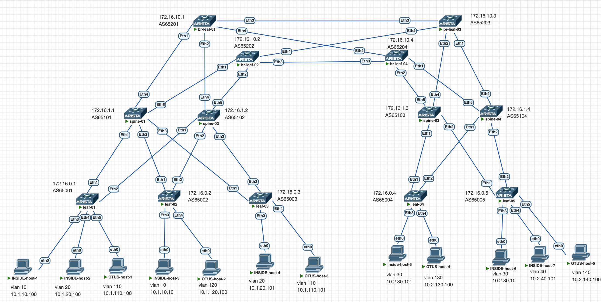

# Архитектура распределённых EVPN/VXLAN-фабрик с междатацентровой связью по EVPN Type-5

## Описание
Проект посвящён разработке и исследованию архитектуры распределённых EVPN/VXLAN-фабрик с использованием междатацентровой связи по EVPN Type-5. Основная цель — создание масштабируемой, отказоустойчивой и высокопроизводительной сети для современных датацентров.  

Данный проект будет содержать две реализаци:   

1) Два DC будут видеть друга как внешнее устройтсво, между ними будет обычный ip трафик.
2) Два DC будут связаны через VXLAN/EVPN type2 и type5 маршруты.

## Топололгия сети 




### Описание топологии 
Используется CLOS архитектура, её суть - максимум масштабируемости и отказоустойчивости при минимуме затрат. Есть два DC соединённые через br-leaf'ы. Для Underlay и Overlay используется eBGP.
 


## IP План сети

| Component       | IPv4 Subnet           | Example                 |
|---------------------|-------------------------|-----------------------------|
| Loopbacks  | 172.16.0.0/21     | 172.16.0.1/32 (leaf-01) <br>172.16.1.1/32 (spine-01)|
| Loopbacks (VRF)  | 172.16.96.0/20   | VRF A:<br>172.16.96.1/32 (leaf-01)<br>VRF B:<br>172.16.98.1/32 (leaf-01)|
| P2P Links          | 192.168.11.0/24<br>192.168.12.0/24   | 192.168.11.0/31 leaf-01, spine-01<br>192.168.12.0/31 leaf-01, spine-02 |
|Service Nerworks | 10.0.0.0/8 | 10.1.10.0/24 - DB segment DC1 <br>10.1.20.0/24 - web-apps segment DC 1<br>10.2.10.0/24 DB segment DC2<br>10.2.20.0/24 - web-apps segment DC 1


## Настройка UNDERLAY связности

Для underlay p2p соединений используется 192.168.Dn+Sn.X. 

Где:  
Dn - Номер ЦОДа  
Sn - Номер spine

### Настройка DC 1

**leaf-01**
```
ip routing                 # Включаем маршрутизацию
interface Ethernet1        # Настраиваем p2p линки
   description "r:spine-01"
   no switchport
   ip address 192.168.11.0/31
!
interface Ethernet2
   description "r:spine-02"
   no switchport
   ip address 192.168.12.0/31
!
interface Loopback0           # Настраиваем loopback
   ip address 172.16.0.1/32

ip prefix-list UNDERLAY-IP     # Создаём префикс-лист для анонсов префиксов в underlay
   seq 10 permit 172.16.0.1/32
!
route-map UNDERLAY-EXPORT permit 10         # Прикручиваем префикс-лист к route-map 
   match ip address prefix-list UNDERLAY-IP

router bgp 65001                       # Создаём процесс BGP
   router-id 172.16.0.1                # Указаываем router-id = ip loopback0
   maximum-paths 10                    # Включаем multipath, с количеством маршуртов 10.
   neighbor 192.168.11.1 remote-as 65101 # Настраиваем связность со spine 
   neighbor 192.168.12.1 remote-as 65102
   redistribute connected route-map UNDERLAY-EXPORT                       # Прикручиваем route-map созданный выше
```


**leaf-02**
```
ip routing
interface Ethernet1
   description r:spine-01
   no switchport
   ip address 192.168.11.2/31
!
interface Ethernet2
   description r:spine-02
   no switchport
   ip address 192.168.12.2/31
!
interface Loopback0
   ip address 172.16.0.2/32

ip prefix-list UNDERLAY-IP
   seq 10 permit 172.16.0.2/32
!
route-map UNDERLAY-EXPORT permit 10
   match ip address prefix-list UNDERLAY-IP

router bgp 65002
   router-id 172.16.0.2
   maximum-paths 10
   neighbor 192.168.11.3 remote-as 65101
   neighbor 192.168.12.3 remote-as 65102
   redistribute connected route-map UNDERLAY-EXPORT
```

**leaf-03**
```
ip routing
interface Ethernet1
   description r:spine-01
   no switchport
   ip address 192.168.11.4/31
!
interface Ethernet2
   description r:spine-02
   no switchport
   ip address 192.168.12.4/31
!
interface Loopback0
   ip address 172.16.0.3/32

ip prefix-list UNDERLAY-IP
   seq 10 permit 172.16.0.3/32
!
route-map UNDERLAY-EXPORT permit 10
   match ip address prefix-list UNDERLAY-IP

router bgp 65003
   router-id 172.16.0.3
   maximum-paths 10
   neighbor 192.168.11.5 remote-as 65101
   neighbor 192.168.12.5 remote-as 65102
   redistribute connected route-map UNDERLAY-EXPORT
```

**spine-01**
```
ip routing
interface Ethernet1
   description r:leaf-01
   no switchport
   ip address 192.168.11.1/31
!
interface Ethernet2
   description r:leaf-02
   no switchport
   ip address 192.168.11.3/31
!
interface Ethernet3
   description r:leaf-03
   no switchport
   ip address 192.168.11.5/31
!
interface Ethernet4
   description "r:br-leaf-01"
   no switchport
   ip address 192.168.11.7/31
!
interface Ethernet5
   description r:br-leaf-02
   no switchport
   ip address 192.168.11.9/31
!
interface Loopback0
   ip address 172.16.1.1/32

ip prefix-list UNDERLAY-IP
   seq 10 permit 172.16.1.1/32
!
route-map UNDERLAY-EXPORT permit 10
   match ip address prefix-list UNDERLAY-IP

router bgp 65101
   router-id 172.16.1.1
   maximum-paths 10
   neighbor 192.168.11.0 remote-as 65001
   neighbor 192.168.11.2 remote-as 65002
   neighbor 192.168.11.4 remote-as 65003
   neighbor 192.168.11.6 remote-as 65201
   neighbor 192.168.11.8 remote-as 65202
   redistribute connected route-map UNDERLAY-EXPORT
```

**spine-02**
```
ip routing
interface Ethernet1
   description r:leaf-01
   no switchport
   ip address 192.168.12.1/31
!
interface Ethernet2
   description r:leaf-02
   no switchport
   ip address 192.168.12.3/31
!
interface Ethernet3
   description r:leaf-03
   no switchport
   ip address 192.168.12.5/31
!
interface Ethernet4
   description "r:br-leaf-01"
   no switchport
   ip address 192.168.12.7/31
!
interface Ethernet5
   description "r:br-leaf-02"
   no switchport
   ip address 192.168.12.9/31
!
interface Loopback0
   ip address 172.16.1.2/32
!
ip prefix-list UNDERLAY-IP
   seq 10 permit 172.16.1.2/32
!
route-map UNDERLAY-EXPORT permit 10
   match ip address prefix-list UNDERLAY-IP
!
router bgp 65102
   router-id 172.16.1.1
   maximum-paths 10
   neighbor 192.168.12.0 remote-as 65001
   neighbor 192.168.12.2 remote-as 65002
   neighbor 192.168.12.4 remote-as 65003
   neighbor 192.168.12.6 remote-as 65201
   neighbor 192.168.12.8 remote-as 65202
   redistribute connected route-map UNDERLAY-EXPORT

```

**br-leaf-01**
```
ip routing
interface Ethernet1
   description r:spine-01
   no switchport
   ip address 192.168.11.6/31
!
interface Ethernet2
   description r:spine-02
   no switchport
   ip address 192.168.12.6/31
!
interface Loopback0
   ip address 172.16.10.1/32

ip prefix-list UNDERLAY-IP
   seq 10 permit 172.16.10.1/32
!
route-map UNDERLAY-EXPORT permit 10
   match ip address prefix-list UNDERLAY-IP

router bgp 65201
   router-id 172.16.10.1
   maximum-paths 10
   neighbor 192.168.11.7 remote-as 65101
   neighbor 192.168.12.7 remote-as 65102
   redistribute connected route-map UNDERLAY-EXPORT
```

**br-leaf-02**
```
ip routing 
interface Ethernet1
   description "r:spine-01"
   no switchport
   ip address 192.168.11.8/31
!
interface Ethernet2
   description "r:spine-02"
   no switchport
   ip address 192.168.12.8/31
!
interface Loopback0
   ip address 172.16.10.2/32
!
ip prefix-list UNDERLAY-IP
   seq 10 permit 172.16.10.2/32
!
route-map UNDERLAY-EXPORT permit 10
   match ip address prefix-list UNDERLAY-IP

router bgp 65202
   router-id 172.16.10.2
   maximum-paths 10
   neighbor 192.168.11.9 remote-as 65101
   neighbor 192.168.12.9 remote-as 65102
   redistribute connected route-map UNDERLAY-EXPORT
```

### Настройка DC 2

**leaf-04**
```
ip routing
interface Ethernet1
   description r:spine-03
   no switchport
   ip address 192.168.21.0/31
!
interface Ethernet2
   description r:spine-04
   no switchport
   ip address 192.168.22.0/31
!
interface Loopback0
   ip address 172.16.0.4/32

ip prefix-list UNDERLAY-IP
   seq 10 permit 172.16.0.4/32
!
route-map UNDERLAY-EXPORT permit 10
   match ip address prefix-list UNDERLAY-IP

router bgp 65004
   router-id 172.16.0.4
   maximum-paths 10
   neighbor 192.168.21.1 remote-as 65103
   neighbor 192.168.22.1 remote-as 65104
   redistribute connected route-map UNDERLAY-EXPORT
```

**leaf-05**
```
ip routing
interface Ethernet1
   description r:spine-03
   no switchport
   ip address 192.168.21.2/31
!
interface Ethernet2
   description r:spine-04
   no switchport
   ip address 192.168.22.2/31
!
interface Loopback0
   ip address 172.16.0.5/32

ip prefix-list UNDERLAY-IP
   seq 10 permit 172.16.0.5/32
!
route-map UNDERLAY-EXPORT permit 10
   match ip address prefix-list UNDERLAY-IP

router bgp 65005
   router-id 172.16.0.5
   maximum-paths 10   
   neighbor 192.168.21.3 remote-as 65103
   neighbor 192.168.22.3 remote-as 65104
   redistribute connected route-map UNDERLAY-EXPORT
```

**spine-03**
```
ip routing
interface Ethernet1
   description r:leaf-04
   no switchport
   ip address 192.168.21.1/31
!
interface Ethernet2
   description r:leaf-05
   no switchport
   ip address 192.168.21.3/31
!
interface Ethernet4
   description br-leaf-03
   no switchport
   ip address 192.168.21.7/31
!
interface Ethernet5
   description br-leaf-04
   no switchport
   ip address 192.168.21.9/31

interface Loopback0
   ip address 172.16.1.3/32   

ip prefix-list UNDERLAY-IP
   seq 10 permit 172.16.1.3/32
!
route-map UNDERLAY-EXPORT permit 10
   match ip address prefix-list UNDERLAY-IP

router bgp 65103
   router-id 172.16.1.3
   maximum-paths 10
   neighbor 192.168.21.0 remote-as 65004
   neighbor 192.168.21.2 remote-as 65005
   neighbor 192.168.21.6 remote-as 65203
   neighbor 192.168.21.8 remote-as 65204
   redistribute connected route-map UNDERLAY-EXPORT
```

**spine-04**
```
ip routing 
interface Ethernet1
   description leaf-04
   no switchport
   ip address 192.168.22.1/31
!
interface Ethernet2
   description leaf-05
   no switchport
   ip address 192.168.22.3/31
!
interface Ethernet4
   description r:br-leaf-03
   no switchport
   ip address 192.168.22.7/31
!
interface Ethernet5
   description r:br-leaf-04
   no switchport
   ip address 192.168.22.9/31
!
interface Loopback0
   ip address 172.16.1.4/32

ip prefix-list UNDERLAY-IP
   seq 10 permit 172.16.1.4/32
!
route-map UNDERLAY-EXPORT permit 10
   match ip address prefix-list UNDERLAY-IP
   neighbor 192.168.22.0 remote-as 65004
   neighbor 192.168.22.2 remote-as 65005
   neighbor 192.168.22.6 remote-as 65203
   neighbor 192.168.22.8 remote-as 65204
   redistribute connected route-map UNDERLAY-EXPORT
```

**br-leaf-03**
```
ip routing 
interface Ethernet1
   description r:spine-04
   no switchport
   ip address 192.168.22.6/31
!
interface Ethernet2
   description r:spine-03
   no switchport
   ip address 192.168.21.6/31
!
interface Loopback0
   ip address 172.16.10.3/32

ip prefix-list UNDERLAY-IP
   seq 10 permit 172.16.10.3/32
!
route-map UNDERLAY-EXPORT permit 10
   match ip address prefix-list UNDERLAY-IP
!
router bgp 65203
   router-id 172.16.10.3
   maximum-paths 10
   neighbor 192.168.21.7 remote-as 65103
   neighbor 192.168.22.7 remote-as 65104
   redistribute connected route-map UNDERLAY-EXPORT

```
**br-leaf-04**
```
ip routing 
interface Ethernet1
   description "r:spine-04"
   no switchport
   ip address 192.168.22.8/31
!
interface Ethernet2
   description "r:spine-03"
   no switchport
   ip address 192.168.21.8/31
!
interface Loopback0
   ip address 172.16.10.4/32

ip prefix-list UNDERLAY-IP
   seq 10 permit 172.16.10.4/32
!
route-map UNDERLAY-EXPORT permit 10
   match ip address prefix-list UNDERLAY-IP


router bgp 65204
   router-id 172.16.10.4
   maximum-paths 10
   neighbor 192.168.21.9 remote-as 65103
   neighbor 192.168.22.9 remote-as 65104
   redistribute connected route-map UNDERLAY-EXPORT
```

## Проверка BGP соседтсва в Underlay  

### DC1


### DC2


Underlay соседство со spine у всех устройств в своём DC установилось, маршруты до loopback получены.

## Настройка Overlay 

### DC1

Все leaf
```
router bgp 6500X    
   neighbor SPINE-OVERLAY peer group              # Создаём peer-group
   neighbor SPINE-OVERLAY update-source Loopback0 # Строим соседство от looback0
   neighbor SPINE-OVERLAY ebgp-multihop 2         # Повышаем TTL для eBGP 
   neighbor SPINE-OVERLAY send-community          # Включаем поддержку передачи community
   neighbor 172.16.1.1 peer group SPINE-OVERLAY   # Добавляем соседей в peer-group
   neighbor 172.16.1.1 remote-as 65101
   neighbor 172.16.1.2 peer group SPINE-OVERLAY
   neighbor 172.16.1.2 remote-as 65102
   !
   address-family evpn                            # Включаем SAFI evpn для рянее созданной peer-group'ы
     neighbor SPINE-OVERLAY activate
   !
   address-family ipv4                            # В overlay явно выключаем SAFI ipv4, чтобы соседство не строилось в underlay

      no neighbor SPINE-OVERLAY activate
!
```

Все spine 

```
router bgp 6510X
   neighbor LEAF-OVERLAY peer group
   neighbor LEAF-OVERLAY update-source Loopback0
   neighbor LEAF-OVERLAY ebgp-multihop 2
   neighbor LEAF-OVERLAY send-community
   neighbor LEAF-UNDERLAY peer group
   neighbor 172.16.0.1 peer group LEAF-OVERLAY
   neighbor 172.16.0.1 remote-as 65001
   neighbor 172.16.0.2 peer group LEAF-OVERLAY
   neighbor 172.16.0.2 remote-as 65002
   neighbor 172.16.0.3 peer group LEAF-OVERLAY
   neighbor 172.16.0.3 remote-as 65003
   neighbor 172.16.10.1 peer group LEAF-OVERLAY
   neighbor 172.16.10.1 remote-as 65201
   neighbor 172.16.10.2 peer group LEAF-OVERLAY
   neighbor 172.16.10.2 remote-as 65202
   !
   address-family evpn
      neighbor LEAF-OVERLAY activate
   !
   address-family ipv4
      no neighbor LEAF-OVERLAY activate
!
```

Все br-leaf

```
router-bgp 6520X
   neighbor SPINE-OVERLAY peer group
   neighbor SPINE-OVERLAY update-source Loopback0
   neighbor SPINE-OVERLAY ebgp-multihop 2
   neighbor SPINE-OVERLAY send-community
   neighbor 172.16.1.1 peer group SPINE-OVERLAY
   neighbor 172.16.1.1 remote-as 65101
   neighbor 172.16.1.2 peer group SPINE-OVERLAY
   neighbor 172.16.1.2 remote-as 65102
   !
   address-family evpn
      neighbor SPINE-OVERLAY activate
   !
   address-family ipv4
      no neighbor SPINE-OVERLAY activate
!
```

### DC2

Все leaf

```
router bgp 6500X
   neighbor SPINE-OVERLAY peer group
   neighbor SPINE-OVERLAY update-source Loopback0
   neighbor SPINE-OVERLAY ebgp-multihop 2
   neighbor SPINE-OVERLAY send-community
   neighbor 172.16.1.3 peer group SPINE-OVERLAY
   neighbor 172.16.1.3 remote-as 65103
   neighbor 172.16.1.4 peer group SPINE-OVERLAY
   neighbor 172.16.1.4 remote-as 65104
   !
   address-family evpn
      neighbor SPINE-OVERLAY activate
   !
   address-family ipv4
      no neighbor SPINE-OVERLAY activate
!
```

Все spine

```
router bgp 6510X
   neighbor LEAF-OVERLAY peer group
   neighbor LEAF-OVERLAY update-source Loopback0
   neighbor LEAF-OVERLAY ebgp-multihop 2
   neighbor LEAF-OVERLAY send-community
   neighbor 172.16.0.4 peer group LEAF-OVERLAY
   neighbor 172.16.0.4 remote-as 65004
   neighbor 172.16.0.5 peer group LEAF-OVERLAY
   neighbor 172.16.0.5 remote-as 65005
   neighbor 172.16.10.3 peer group LEAF-OVERLAY
   neighbor 172.16.10.3 remote-as 65203
   neighbor 172.16.10.4 peer group LEAF-OVERLAY
   neighbor 172.16.10.4 remote-as 65204
   !
   address-family evpn
      neighbor LEAF-OVERLAY activate
   !
   address-family ipv4
      no neighbor LEAF-OVERLAY activate
!
```


Все br-leaf

```
router bgp 6520X
   neighbor SPINE-OVERLAY peer group
   neighbor SPINE-OVERLAY update-source Loopback0
   neighbor SPINE-OVERLAY ebgp-multihop 2
   neighbor SPINE-OVERLAY send-community
   neighbor 172.16.1.3 peer group SPINE-OVERLAY
   neighbor 172.16.1.3 remote-as 65103
   neighbor 172.16.1.4 peer group SPINE-OVERLAY
   neighbor 172.16.1.4 remote-as 65104
   !
   address-family evpn
      neighbor SPINE-OVERLAY activate
   !
   address-family ipv4
      no neighbor SPINE-OVERLAY activate
!
```

## Проверка evpn-соседтва 

### DC1

**spine-01**


**spine-02**


### DC2

**spine-01**


**spine-02**


## Настройка VXLAN 

Произведём настройку vlan-aware-bundle, Symmetric irb и anycast gateway, два vrf - INSIDE и OTUS.

### DC1

Все leaf

```
vrf instance INSIDE    # Создаём VRF 
vrf instance OTUS
ip routing vrf INSIDE  # Включаем маршрутизацию в VRF
ip routing vrf OTUS

interface Vxlan1                    # Создаём туннельный интерфейс      
   vxlan source-interface Loopback0 # Указываем инерфейс с которого будем строить vxlan туннель
   vxlan udp-port 4789              # Порт для VXLAN поумолчанию
   vxlan vlan 10 vni 10010          # Добавляем vlan + vni в туннель
   vxlan vlan 20 vni 10020
   vxlan vlan 110 vni 10110
   vxlan vlan 120 vni 10120
   vxlan vrf INSIDE vni 50100       # Добавляем l3 VNI для VRF
   vxlan vrf OTUS vni 50200

ip virtual-router mac-address 00:00:00:00:00:01  # Указываем mac для виртуальных адресов

interface Vlan10                    # Создаём SVI
   vrf INSIDE                       # Засовываем SVI в VRF
   ip address virtual 10.1.10.1/24  # Добавляем anycast gw address
!
interface Vlan20
   vrf INSIDE
   ip address virtual 10.1.20.1/24
!
interface Vlan110
   vrf OTUS
   ip address virtual 10.1.110.1/24
!
interface Vlan120
   vrf OTUS
   ip address virtual 10.1.120.1/2


router bgp 6500X
   vlan-aware-bundle INSIDE               # Настраива vlan-aware
      rd 172.16.0.X:10100
      route-target both 100:10100
      redistribute learned
      vlan 10,20,110,120

  vrf INSIDE                              # Настраиваем vrf для работы с BGP
      rd 172.16.0.X:50100
      route-target import evpn 100:50100
      route-target export evpn 100:50100
   !
   vrf OTUS
      rd 172.16.0.X:50200
      route-target import evpn 200:50200
      route-target export evpn 200:50200
```

### DC2

Все leaf 

```
vrf instance INSIDE
vrf instance OTUS
ip routing vrf INSIDE
ip routing vrf OTUS

interface Vxlan1
   vxlan source-interface Loopback0
   vxlan udp-port 4789
   vxlan vlan 30 vni 10030
   vxlan vlan 40 vni 10040
   vxlan vlan 130 vni 10130
   vxlan vlan 140 vni 10140
   vxlan vrf INSIDE vni 50100
   vxlan vrf OTUS vni 50200
!

ip virtual-router mac-address 00:00:00:00:00:01

interface Vlan30
   vrf INSIDE
   ip address virtual 10.2.30.1/24
!
interface Vlan40
   vrf INSIDE
   ip address virtual 10.2.40.1/24
!
interface Vlan130
   vrf OTUS
   ip address virtual 10.2.130.1/24
!
interface Vlan140
   vrf OTUS
   ip address virtual 10.2.140.1/24
!

router bgp 6500X

vlan-aware-bundle INSIDE
      rd 172.16.0.X:10100
      route-target both 100:10100
      redistribute learned
      vlan 30,40,130,140
   !
   vrf INSIDE
      rd 172.16.0.X:50100
      route-target import evpn 100:50100
      route-target export evpn 100:50100
   !
   vrf OTUS
      rd 172.16.0.X:50200
      route-target import evpn 200:50200
      route-target export evpn 200:50200
!
```


## Проверка Vxlan внутри DC

Просмотрим машруты и проверим свзяность внутри VRF

### DC1

EVPN маршруты на leaf-01


Проверка связности внутри vrf INSIDE


Проверка связности внутри vrf OTUS


### DC2

EVPN маршруты на leaf-04


Проверка связности внутри vrf INSIDE


Проверка связности внутри vrf OTUS


## Настройка br-leaf для DCI 

### Вариант №1 
Настроим на br-leaf туннельный Vxlan итерефейс, для инкапсуляции и декапсуляции трафика внутри DC. На межцодовых линках настроим субинтерфейсы с dot1q инкапсуляцией и назначим каждому VRF свой субинтерфейс. Для VRF INSIDE — VLAN 100, для VRF OTUS — VLAN 200. Эти интерфейсы используются для обмена EVPN Type-5 маршрутами между br-leaf-ами разных дата-центров через point-to-point соединения.
Ко всему этому на границах ЦОД настроим агрегацию маршрутов другого ЦОД.


На всех br-leaf настроим два vrf - INSIDE и OTUS

```
vrf instance INSIDE
vrf instance OTUS
ip routing vrf INSIDE
ip routing vrf OTUS


interface Vxlan1
   vxlan source-interface Loopback0
   vxlan udp-port 4789
   vxlan vrf INSIDE vni 50100
   vxlan vrf OTUS vni 50200

router bgp 6520X

   vrf INSIDE
      rd 172.16.10.X:50100
      route-target import evpn 100:50100
      route-target export evpn 100:50100
  
  vrf OTUS
      rd 172.16.10.X:50200
      route-target import evpn 200:50200
      route-target export evpn 200:50200

   vlan-aware-bundle INSIDE
      rd 172.16.10.X:10100
      route-target both 100:10100
      redistribute learned
```

Настроим DCI пиринг внутри каждого VRF для обмена Type-5 маршрутами.

#### DC1

**br-leaf-01**
```
interface Ethernet3
   description "r:br-leaf-03
   no switchport
!
interface Ethernet3.100                    # Настроим субинтерфейс для vrf INSIDE
   description "r:br-leaf-03 c:vrf-INSIDE"
   encapsulation dot1q vlan 100
   vrf INSIDE
   ip address 192.168.100.0/31
!
interface Ethernet3.200                    # Настроим субинтерфейс для vrf OTUS
   description "r:br-leaf-03 c:vrf-OTUS"
   encapsulation dot1q vlan 200
   vrf OTUS
   ip address 192.168.200.0/31
!
interface Ethernet4
   description "r:br-leaf-04"
   no switchport
!
interface Ethernet4.100
   description "r:br-leaf-04 c:vrf-INSIDE"
   encapsulation dot1q vlan 100
   vrf INSIDE
   ip address 192.168.100.2/31
!
interface Ethernet4.200
   description "r:br-leaf-04 c:vrf-OTUS"
   encapsulation dot1q vlan 200
   vrf OTUS
   ip address 192.168.200.2/31
!
router bgp 65201
  vrf INSIDE
      neighbor 192.168.100.1 remote-as 65203     # Пиринг с br-leaf-03
      neighbor 192.168.100.3 remote-as 65204     # Пиринг с br-leaf-04 
      aggregate-address 10.2.0.0/16 summary-only # Агрегируем полученные префиксы
   !
   vrf OTUS
      neighbor 192.168.200.1 remote-as 65203  # Пиринг с br-leaf-03
      neighbor 192.168.200.3 remote-as 65204  # Пиринг с br-leaf-04
      aggregate-address 10.2.0.0/16 summary-only # Агрегируем полученные префиксы
```

**br-leaf-02**
```
interface Ethernet3
   description "r:br-leaf-04
   no switchport
   ip address 192.168.100.2/31
!
interface Ethernet3.100
   description "r:br-leaf-04" c:vrf-INSIDE"
   encapsulation dot1q vlan 100
   vrf INSIDE
   ip address 192.168.100.4/31
!
interface Ethernet3.200
   description "r:br-leaf-04" c:vrf-OTUS"
   encapsulation dot1q vlan 200
   vrf OTUS
   ip address 192.168.200.4/31
!
interface Ethernet4
   description "r:br-leaf-03"
   no switchport
!
interface Ethernet4.100
   description "r:br-leaf-03 c:vrf-INSIDE"
   encapsulation dot1q vlan 100
   vrf INSIDE
   ip address 192.168.100.6/31
!
interface Ethernet4.200
   description "r:br-leaf-03 c:vrf-OTUS"
   encapsulation dot1q vlan 200
   vrf OTUS
   ip address 192.168.200.6/31

router bgp 65202
   vrf INSIDE
      neighbor 192.168.100.5 remote-as 65204     # Пиринг с br-leaf-04
      neighbor 192.168.100.7 remote-as 65203     # Пиринг с br-leaf-03
      aggregate-address 10.2.0.0/16 summary-only # Агрегируем полученные префиксы
   !
   vrf OTUS
      neighbor 192.168.200.5 remote-as 65204     # Пиринг с br-leaf-04
      neighbor 192.168.200.7 remote-as 65203     # Пиринг с br-leaf-03
      aggregate-address 10.2.0.0/16 summary-only # Агрегируем полученные префиксы
```

#### DC2

**br-leaf-03**

```
interface Ethernet3
   description r:br-leaf-01
   no switchport
!
interface Ethernet3.100
   description "r:br-leaf-01 c:vrf-INSIDE"
   encapsulation dot1q vlan 100
   vrf INSIDE
   ip address 192.168.100.1/31
!
interface Ethernet3.200
   description "r:br-leaf-01 c:vrf-OTUS"
   encapsulation dot1q vlan 200
   vrf OTUS
   ip address 192.168.200.1/31
!
interface Ethernet4
   description "r:br-leaf-02"
   no switchport
!
interface Ethernet4.100
   description r:br-leaf-02 c:vrf-INSIDE
   encapsulation dot1q vlan 100
   vrf INSIDE
   ip address 192.168.100.7/31
!
interface Ethernet4.200
   description "r:br-leaf-02 c:vrf-OTUS"
   encapsulation dot1q vlan 200
   vrf OTUS
   ip address 192.168.200.7/31
!
router bgp 65203
   vrf INSIDE
      neighbor 192.168.100.0 remote-as 65201     # Пиринг с br-leaf-01
      neighbor 192.168.100.6 remote-as 65202     # Пиринг с br-leaf-02
      aggregate-address 10.1.0.0/16 summary-only # Агрегируем полученные префиксы
   !
   vrf OTUS
      neighbor 192.168.200.0 remote-as 65201     # Пиринг с br-leaf-01
      neighbor 192.168.200.6 remote-as 65202     # Пиринг с br-leaf-02
      aggregate-address 10.1.0.0/16 summary-only # Агрегируем полученные префиксы
```

**br-leaf-04**

```
interface Ethernet3
   description "r:br-leaf-02"
   no switchport
!
interface Ethernet3.100
   description "r:br-leaf-02 c:vrf-INSIDE"
   encapsulation dot1q vlan 100
   vrf INSIDE
   ip address 192.168.100.5/31
!
interface Ethernet3.200
   description "r:br-leaf-02 c:vrf-OTUS"
   encapsulation dot1q vlan 200
   vrf OTUS
   ip address 192.168.200.5/31
!
interface Ethernet4
   description "r:br-leaf-01"
   no switchport
!
interface Ethernet4.100
   description "r:br-leaf-01 c:vrf-INSIDE"
   encapsulation dot1q vlan 100
   vrf INSIDE
   ip address 192.168.100.3/31
!
interface Ethernet4.200
   description "r:br-leaf-01 c:vrf-OTUS"
   encapsulation dot1q vlan 200
   vrf OTUS
   ip address 192.168.200.3/31

router bgp 65204
   vrf INSIDE
      neighbor 192.168.100.2 remote-as 65201     # Пиринг с br-leaf-01
      neighbor 192.168.100.4 remote-as 65202     # Пиринг с br-leaf-02
      aggregate-address 10.1.0.0/16 summary-only # Агрегируем полученные префиксы
   !
   vrf OTUS
      neighbor 192.168.200.2 remote-as 65201     # Пиринг с br-leaf-01
      neighbor 192.168.200.4 remote-as 65202     # Пиринг с br-leaf-02
      aggregate-address 10.1.0.0/16 summary-only # Агрегируем полученные префиксы
```

#### Проверка DCI связности

Провериим состояние bgp соседства.


s


Соседство установлено успешно.

Произведём сетевую активность на конечных устройствах и просмотрим информацию о bgp EVPN маршрутах.


#### Проблемы с неоптимальными маршрутами 

При данный реализации можем заметить много неоптимальных маршрутов на br-leaf, который хоть на leaf и не отдаются, однако могут вызвать проблемы.

К примеру:
```
                                 -                     -       100     0       65204 65202 65203 65104 65004 i
 * >      RD: 172.16.10.1:50200 ip-prefix 10.2.0.0/16
```
Получается имеет вот такой путь.


Но на leaf будет отдан лучший.

```
 * >Ec    RD: 172.16.10.1:50100 ip-prefix 10.1.0.0/16
                                 -                     -       100     0       65203 65202 65101 65001 i
```


Такое точно нам не нужно.

Что видят leaf:


Как результат, leaf знают только самые лучшие маршруты и нас всё устраивает, кроме
```
 * >      RD: 172.16.10.1:50200 ip-prefix 10.1.0.0/16
                                 172.16.10.1           -       100     0       65101 65201 65204 65202 65102 65002 i
```

Этот маршрут не попал в таблицу маршрутизациии, но навести порядок стоит.

Одним из вариантов решения будет через prefix-list - как по мне самое простое.

Все br-leaf в первом DC
```
ip prefix-list MY-NET seq 10 permit 10.1.0.0/16 # Создаём префикс лист включающий собственнную сеть DC

route-map MY-NET-NO-REC deny 5       # Прикручиваем к route-map, где запрещаем собственную сеть и разрешаем другие.
  match ip address prefix-list MY-NET

route-map MY-NET-NO-REC permit 10
```

И далее применяем route-map на вход в сосесдствах с другим DC.  

**br-leaf-01**

```
router bgp 65201
   vrf INSIDE
      neighbor 192.168.100.1 route-map MY-NET-NO-REC in
      neighbor 192.168.100.3 route-map MY-NET-NO-REC in
   vrf OTUS
      neighbor 192.168.200.1 route-map MY-NET-NO-REC in
      neighbor 192.168.200.3 route-map MY-NET-NO-REC in
```

**br-leaf-02**
```
router bgp 65202
   vrf INSIDE
      neighbor 192.168.100.5 route-map MY-NET-NO-REC in
      neighbor 192.168.100.7 route-map MY-NET-NO-REC in
   vrf OTUS
      neighbor 192.168.200.5 route-map MY-NET-NO-REC in
      neighbor 192.168.200.7 route-map MY-NET-NO-REC in
```

Все br-leaf во втором DC 
```
ip prefix-list MY-NET seq 10 permit 10.2.0.0/16

route-map MY-NET-NO-REC deny 5
  match ip address prefix-list MY-NET

route-map MY-NET-NO-REC permit 10
```

**br-leaf-03**

```
router bgp 65203
   vrf INSIDE
      neighbor 192.168.100.0 route-map MY-NET-NO-REC in
      neighbor 192.168.100.6 route-map MY-NET-NO-REC in
   vrf OTUS
      neighbor 192.168.200.0 route-map MY-NET-NO-REC in
      neighbor 192.168.200.6 route-map MY-NET-NO-REC in
```
**br-leaf-04**
```
router bgp 65204
   vrf INSIDE
      neighbor 192.168.100.2 route-map MY-NET-NO-REC in
      neighbor 192.168.100.4 route-map MY-NET-NO-REC in
   vrf OTUS
      neighbor 192.168.200.2 route-map MY-NET-NO-REC in
      neighbor 192.168.200.4 route-map MY-NET-NO-REC in
```


Как итог, DC больше не видит себя через другой DC:

Было: 


Стало:


Картина на leaf:

BGP evpn таблица


Маршрутная информация в VRF


#### Проверим связность между DC 

В VRF INSIDE:


В VRF OTUS:


Связность есть, два DC видят друг друга как внешнее устройство, между DC обычный IP, без какой либо дополнительной инкапсуляции.


Полная конфигурация для этой реализации находится [тут](https://github.com/IamMemasik/OTUS-Network-design/tree/main/Project/vrf-lite).


### Вариант 2.
