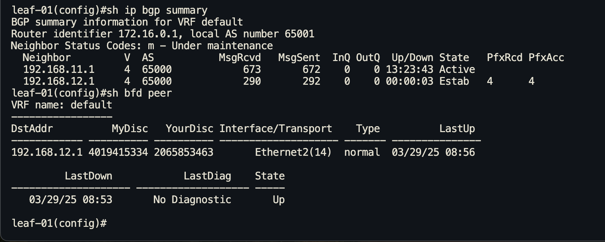

# Построение Underlay сети(BGP)

## Цель 
Настроить BGP для Underlay сети


## Топология 


Настройка ip адресов и проверка связности на point to point link'ах выполнена в [Лабораторной работе № 1](https://github.com/IamMemasik/OTUS-Network-design/tree/main/lab-01), поэтому сразу переходим в настройке eBGP

## Настройка ebgp соседства

Для построения underlay на eBGP будем использовать одинаковую AS на spine - 65000, и разную на leaf 65001, 65002, 65003 для leaf-01, 02 и 03 соответственно.


### Рассмотрим установление bgp соседства

Рассмотрим детально процесс уставления BGP сессии.
**Leaf-01**
```
ip prefix-list UNDERLAY_IP        # Создаём prefix-list с underlay ip
   seq 10 permit 192.168.11.0/31
   seq 20 permit 192.168.12.0/31
   seq 30 permit 172.16.0.1/32
!
route-map UNDERLAY_EXPORT permit 10         # Создаём Route-map и прикручиваем к ней созданный ранее prefix-list
   match ip address prefix-list UNDERLAY_IP 
!
router bgp 65001                 # Запускаем bgp процесс с номером AS - 65001
   router-id 172.16.0.1          # Делаем Router-id = ip loopback
   neighbor SPINE peer group     # Создаём peer-group для spine'ов
   neighbor SPINE remote-as 65000  # Указываем AS SPINE'ов
   neighbor 192.168.11.1 peer group SPINE # Запускаем соседство со spine-01 и 02 в peer group
   neighbor 192.168.12.1 peer group SPINE 
   redistribute connected route-map UNDERLAY_EXPORT # - Применяем Route-map для того чтобы отдать underlay сети на spine
!
```

Запустим dump трафика на Ether 1 и Ether 2 и просмотрим сообщения установления bgp-сессии от leaf-01 до spine-02.


Заметим что spine шлёт reset. 
Это происходит потому что не запущен BGP процесс на spine-02.

Запустим BGP процесс на spine-02 и снова обратим внимание на dump


```
router bgp 65000
```


Заметим, что spine отмалчивается, это происходит из-за того что spine не ожидает соединения от leaf-01.

Настроим соседа leaf-01 для spine-02, но ради эксперимента сделаем соседа выключенным.

**spine-02**
```
router bgp 65000
   router-id 172.16.1.2
   neighbor 192.168.12.0 remote-as 65001
   neighbor 192.168.12.0 shutdown

```
И снова обратим внимание на dump и на статусы соседей.


В дампе видим, что tcp-сессия смогла установиться и leaf-01 послал hello-собощение на spine-02, но из-за того что на spine-02 сосед настроен в shutdown, то он закрывает сессию, а leaf-01 находиться в состояниях ACTIVE --> OpenSent --> Active --> OpenSent.


Включим соседа spine-02 и посмотрим dump

```
 no neighbor 192.168.12.0 shutdown
```


Видим успешно установленую TCP сессию (обратим внимание на TTL = 1 - значение пот умолчанию для eBGP), а затем и BGP.
leaf-01 и spine-01 успешно согласовали соседство и leaf-01 отдал свои маршруты (NLRI) на spine-02, а spine-02, в свою очередь, ничего не отдал, так как мы не указали что отдавать.


Просмотрим что отдаёт и получает spine-02


Настроим route-map на spine-02
```
ip prefix-list UNDERLAY_IP
   seq 10 permit 192.168.12.0/31
   seq 20 permit 192.168.12.2/31
   seq 30 permit 192.168.12.4/31
   seq 40 permit 172.16.1.2/32


route-map UNDERLAY_EXPORT permit 10
   match ip address prefix-list UNDERLAY_IP

router bgp 65000
   redistribute connected route-map UNDERLAY_EXPORT
```

После настройки сразу увидим update от spine-02 с префиксами в NLRI, которые мы проаносировали.

 

И на самом spine-02 теперь видно какие маршруты он отдаёт


Просмотим таблицы маршрутизации на leaf-01 и spine-02.

**leaf-01**


**spine-02**


Между leaf-01 и spine-02 связность в uderlay поднята.


## Настрока BFD

Включим BFD на leaf-01 для peer group SPINE.

```
router bgp 65001
   neighbor SPINE bfd 
```


Пока BFD ниразу не поднялось, BGP сессия не будет разорвана.


Включим BFD на Spine-02
```
router bgp 65000
   neighbor 192.168.12.0 bfd 
```

В дампе заметим, как bfd перешёл в состояние UP


Проверим, работу BFD, умышлено поменяем ip адрес spine-02 на интерфейсе Ethernet 1, после чего должен моментально обнаружить разрыв связи и погасить bgp соседтво.

**spine-02**
```
int eth1
ip address 192.168.112.1/31 
```


Видно, что после потери 3 bfd сообщений, bgp сессия была разорвана.


Вернём правильный ip адрес и проверим bfd и bgp соседство.

**leaf-01**
```
int eth1
ip address 192.168.12.1/31 
```





BFD настроен и отрабатывает корректно.


## Настроим eBGP и BFD на всех устройтсвах

### Итоговая конфигурация underlay на leaf

**leaf-01**
```
ip prefix-list UNDERLAY_IP
   seq 10 permit 192.168.11.0/31
   seq 20 permit 192.168.12.0/31
   seq 30 permit 172.16.0.1/32
!
route-map UNDERLAY_EXPORT permit 10
   match ip address prefix-list UNDERLAY_IP
!
router bgp 65001
   router-id 172.16.0.1
   neighbor SPINE peer group
   neighbor SPINE remote-as 65000
   neighbor SPINE bfd
   neighbor 192.168.11.1 peer group SPINE
   neighbor 192.168.12.1 peer group SPINE
   redistribute connected route-map UNDERLAY_EXPORT
!
end
```
**leaf-02**
```
ip prefix-list UNDERLAY_IP
   seq 10 permit 192.168.11.2/31
   seq 20 permit 192.168.12.2/31
   seq 30 permit 172.16.0.2/32
!
route-map UNDERLAY_EXPORT permit 10
   match ip address prefix-list UNDERLAY_IP
!
router bgp 65002
   router-id 172.16.0.2
   neighbor SPINE peer group
   neighbor SPINE remote-as 65000
   neighbor SPINE bfd
   neighbor 192.168.11.3 peer group SPINE
   neighbor 192.168.12.3 peer group SPINE
   redistribute connected route-map UNDERLAY_EXPORT
!
end
```

**leaf-03**

```
ip prefix-list UNDERLAY_IP
   seq 10 permit 192.168.11.4/31
   seq 20 permit 192.168.12.4/31
   seq 30 permit 172.16.0.3/32
!
route-map UNDERLAY_EXPORT permit 10
   match ip address prefix-list UNDERLAY_IP
!
router bgp 65003
   router-id 172.16.0.3
   neighbor SPINE peer group
   neighbor SPINE remote-as 65000
   neighbor SPINE bfd
   neighbor 192.168.11.5 peer group SPINE
   neighbor 192.168.12.5 peer group SPINE
   redistribute connected route-map UNDERLAY_EXPORT
!
end
```


### Итоговая конфигурация underlay на spine

**Spine-01** 
```
ip prefix-list UNDERLAY_IP
   seq 10 permit 192.168.11.0/31
   seq 20 permit 192.168.11.2/31
   seq 30 permit 192.168.11.4/31
   seq 40 permit 172.16.1.1/32
!
route-map UNDERLAY_EXPORT permit 10
   match ip address prefix-list UNDERLAY_IP
!
router bgp 65000
   router-id 172.16.1.1
   neighbor 192.168.11.0 remote-as 65001
   neighbor 192.168.11.0 bfd
   neighbor 192.168.11.2 remote-as 65002
   neighbor 192.168.11.2 bfd
   neighbor 192.168.11.4 remote-as 65003
   neighbor 192.168.11.4 bfd
   redistribute connected route-map UNDERLAY_EXPORT
!
end
```
**Spine-02**
```
 ip prefix-list UNDERLAY_IP
   seq 10 permit 192.168.12.0/31
   seq 20 permit 192.168.12.2/31
   seq 30 permit 192.168.12.4/31
   seq 40 permit 172.16.1.2/32
!
route-map UNDERLAY_EXPORT permit 10
   match ip address prefix-list UNDERLAY_IP
!
router bgp 65000
   router-id 172.16.1.2
   neighbor 192.168.12.0 remote-as 65001
   neighbor 192.168.12.0 bfd
   neighbor 192.168.12.2 remote-as 65002
   neighbor 192.168.12.2 bfd
   neighbor 192.168.12.4 remote-as 65003
   neighbor 192.168.12.4 bfd
   redistribute connected route-map UNDERLAY_EXPORT
!
end
```
### Просмотрим информацию по BGP на всех устройствах
```
show ip bgp summary
show ip bgp
show ip route bgp detail
```

**leaf-01**


**leaf-02**


**leaf-03**


**spine-01**


**spine-02**


Заметим, что на leaf маршрут до loopback других leaf, выбирается только через одно устройтсво, через spine-01 - это из-за того что в BGP по умолчанию выключена балансирока. А маршрут через spine-01 выбрался по Best Path Selection, на шаге с router-id, 172.16.1.1(spine-01) < 172.16.1.2(spine-02).

Включим балансировку для bgp на всех устройствах, но изменения будут замечены только на leaf, т.к. на spine нечего балансировать.
```
maximum-paths 10
```

Просмотрим, что именилось в таблице маршрутизации
```
sh ip route bgp detail
sh ip bgp
```

**leaf-01**


**leaf-02**


**leaf-03**


Теперь видим, что трафик будет балансироваться между spine-01 и spine-02.

Проверим связность с leaf-01 до всех loopback интерфейсов.

**leaf-01**


К сожалению, из-за особенностей виртуализации не получилось выловить в дампе как балансируется трафик, но на реальном оборудовании балансировка должна работать.


И для связности looback не нужно отдавать p2p сети т.к. в eBGP nexthop будут стоять spine, а не ip лифа.

Поэтому уберём из underlay p2p сети, перезапустим BGP сессию 

```
clear ip bgp *
```

И посмотрим теперь маршруты на leaf и spine

**leaf-01**


**leaf-02**


**leaf-03**


**spine-01**


**spine-02**


И снова проверим связность от leaf-01.


Итоговая конфигурация файлах:


[Leaf-01](https://github.com/IamMemasik/OTUS-Network-design/tree/main/lab-04/leaf-01.txt)

[Leaf-02](https://github.com/IamMemasik/OTUS-Network-design/tree/main/lab-04/leaf-02.txt)

[Leaf-03](https://github.com/IamMemasik/OTUS-Network-design/tree/main/lab-04/leaf-03.txt)

[Spine-01](https://github.com/IamMemasik/OTUS-Network-design/tree/main/lab-04/spine-01.txt)

[Spine-02](https://github.com/IamMemasik/OTUS-Network-design/tree/main/lab-04/spine-02.txt)

