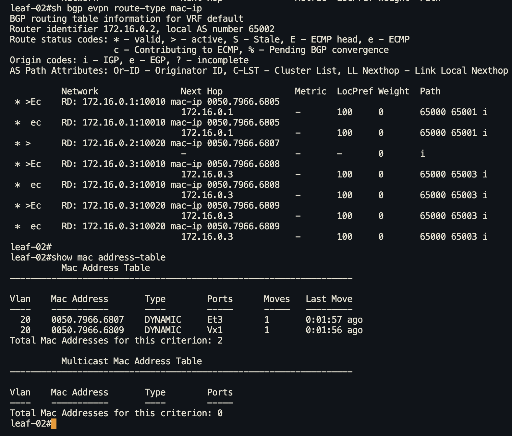
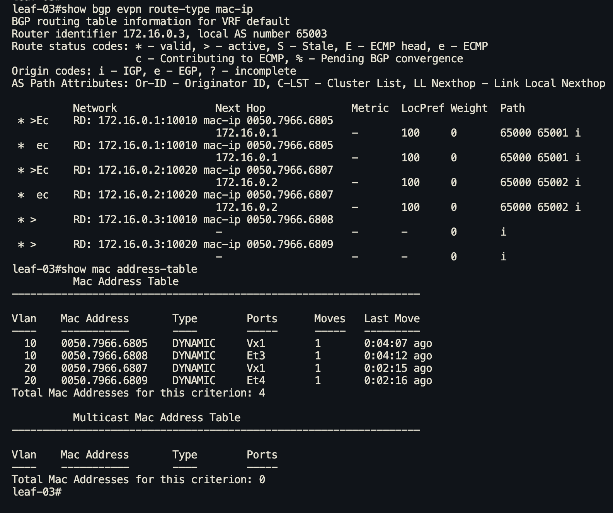

# VxLAN. L2 VNI


## Цель 
Настроить Overlay на основе VxLAN EVPN для L2 связанности между клиентами


## Топология 


Настройка ip адресов и проверка связности на point to point link'ах выполнена в [Лабораторной работе № 1](https://github.com/IamMemasik/OTUS-Network-design/tree/main/lab-01)

В качетсве underlay сети используется eBGP, разбор и настройка выполнена в [Лабораторной работе № 4](https://github.com/IamMemasik/OTUS-Network-design/blob/main/lab-04/Readme.md)


## Настройка ebgp Overlay

Настроим eBGP overlay с loopback интерфейсов.

*Замечание*  

*При настроке AFI epvn необходимо включить multi-agent на всех устройствах и перезагрузить их.* 

*! Routing protocols model multi-agent must be configured for EVPN address-family*

```
service routing protocols model multi-agent
```


### Настройка на leaf 

**leaf-01**
```
router bgp 65001
   neighbor SPINE_OVERLAY peer group              # Создаём peer group для spine overlay
   neighbor SPINE_OVERLAY remote-as 65000         # Указываем AS спайнов
   neighbor SPINE_OVERLAY update-source Loopback0 # Строим сессию с loopback
   neighbor SPINE_OVERLAY bfd                     # Включаем bfd
   neighbor SPINE_OVERLAY ebgp-multihop 2         # По умолчанию ttl = 1, т.к. мы строим сессию с loopback нам необходимо повысить ttl до 2
   neighbor SPINE_OVERLAY send-community          # Включаем поддержку передачи extended community
   neighbor 172.16.1.1 peer group SPINE_OVERLAY   # Добавляем spine-01 в peer-group
   neighbor 172.16.1.2 peer group SPINE_OVERLAY   # Добавляем spine-02 в peer-group
   !
   address-family evpn                   # Включаем AFI evpn
      neighbor SPINE_OVERLAY activate    # Активируем для overlay группы
   !
   address-family ipv4
      no neighbor SPINE_OVERLAY activate # В overlay явно выключаем AFI ipv4, чтобы соседство не строилось в underlay
```

**leaf-02**
```
router bgp 65002
   neighbor SPINE_OVERLAY peer group
   neighbor SPINE_OVERLAY remote-as 65000
   neighbor SPINE_OVERLAY update-source Loopback0
   neighbor SPINE_OVERLAY bfd
   neighbor SPINE_OVERLAY ebgp-multihop 2
   neighbor SPINE_OVERLAY send-community
   neighbor 172.16.1.1 peer group SPINE_OVERLAY
   neighbor 172.16.1.2 peer group SPINE_OVERLAY   
   address-family evpn
      neighbor SPINE_OVERLAY activate
   !
   address-family ipv4
      no neighbor SPINE_OVERLAY activate
```


**leaf-03**
```
router bgp 65003
   neighbor SPINE_OVERLAY peer group
   neighbor SPINE_OVERLAY remote-as 65000
   neighbor SPINE_OVERLAY update-source Loopback0
   neighbor SPINE_OVERLAY bfd
   neighbor SPINE_OVERLAY ebgp-multihop 2
   neighbor SPINE_OVERLAY send-community
   neighbor 172.16.1.1 peer group SPINE_OVERLAY
   neighbor 172.16.1.2 peer group SPINE_OVERLAY   
   address-family evpn
      neighbor SPINE_OVERLAY activate
   !
   address-family ipv4
      no neighbor SPINE_OVERLAY activate
```


### Настройка на spine

**spine-01**
```
router bgp 65000
   neighbor LEAF_OVERLAY peer group
   neighbor LEAF_OVERLAY update-source Loopback0
   neighbor LEAF_OVERLAY ebgp-multihop 2
   neighbor LEAF_OVERLAY send-community
   neighbor 172.16.0.1 peer group LEAF_OVERLAY
   neighbor 172.16.0.1 remote-as 65001
   neighbor 172.16.0.2 peer group LEAF_OVERLAY
   neighbor 172.16.0.2 remote-as 65002
   neighbor 172.16.0.3 peer group LEAF_OVERLAY
   neighbor 172.16.0.3 remote-as 65003
   address-family evpn
      neighbor LEAF_OVERLAY activate
   !
   address-family ipv4
      no neighbor LEAF_OVERLAY activate
```
**spine-02**
```
router bgp 65000
   neighbor LEAF_OVERLAY peer group
   neighbor LEAF_OVERLAY update-source Loopback0
   neighbor LEAF_OVERLAY ebgp-multihop 2
   neighbor LEAF_OVERLAY send-community
   neighbor 172.16.0.1 peer group LEAF_OVERLAY
   neighbor 172.16.0.1 remote-as 65001
   neighbor 172.16.0.2 peer group LEAF_OVERLAY
   neighbor 172.16.0.2 remote-as 65002
   neighbor 172.16.0.3 peer group LEAF_OVERLAY
   neighbor 172.16.0.3 remote-as 65003
   address-family evpn
      neighbor LEAF_OVERLAY activate
   !
   address-family ipv4
      no neighbor LEAF_OVERLAY activate
```

Видим, что соседство в evpn поднялось 

**spine-01**


**spine-02**


### Установление сессии

Рассмотрим процесс установление сессии в Wireshark на примере leaf-01 и spine-01, для этого запустим dump на интерфейсе eth1 leaf-01

Сообщение Open от leaf-01


Сообщение Open от spine-01 


Заметим, что у обоих в SAFI используется EPVN.


## Настроим mac-vrf  

В соответствии с ip планом в [Лабораторной работе № 1](https://github.com/IamMemasik/OTUS-Network-design/tree/main/lab-01) возьмём следующие сети:

10.1.10.0/24 - vlan 10 - vni 10010
10.1.20.0/24 - vlan 20 - vni 10020

### Настроим модель EVPN VLAN-Based Service

**leaf-01**
```
router bgp 65001
vlan 10
rd 172.16.0.1:10010         # rd в формате Loopback + vni
route-target both 10:10010  # rt в формате vlan + vni
redistribute learned        # redistribute выученных локально mac-адресов 
!

interface Vxlan1                    # Создаём туннельный интерфейс 
   vxlan source-interface Loopback0 # Указываем инерфейс с которого будем строить vxlan туннель
   vxlan vlan 10 vni 10010          # Добавляем vlan + vni в туннель

interface Ethernet3
   switchport access vlan 10
```


**leaf-02**
```
router bgp 65002
vlan 20
rd 172.16.0.2:10020
route-target both 20:10020
redistribute learned
!
interface Vxlan1
   vxlan source-interface Loopback0
   vxlan vlan 20 vni 10020
!
interface Ethernet3
   switchport access vlan 20
```

**leaf-03**
```
router bgp 65003
vlan 10
rd 172.16.0.3:10010
route-target both 20:10020
redistribute learned
!
vlan 20
rd 172.16.0.3:10020
route-target both 20:10020
redistribute learned

interface Vxlan1
   vxlan source-interface Loopback0
   vxlan vlan 10 vni 10010
   vxlan vlan 20 vni 10020

interface Ethernet3
   switchport access vlan 10

interface Ethernet4
   switchport access vlan 20
```


Таким образом на  
leaf-01 - 10 vlan  
leaf-02 - 20 vlan  
leaf-03 - 10 и 20 vlan 

После настройки в dump'е можно заметить, что leaf'ы сгенерировали update где передают type 3 маршрут.

**leaf-01**


Обратим внимение на значения:

В EVPN NLRI: Inclusive Multicast Route
```
Route Type: Inclusive Multicast Route (3)
Route Distinguisher: 0001ac100001271a (172.16.0.1:10010)
Ethernet Tag ID: 0
IPv4 address: 172.16.0.1
```
В Path Attribute - EXTENDED_COMMUNITIES
```
Route Target: 10:10010 [Transitive 2-Octet AS-Specific]
```
В Path Attribute - PMSI_TUNNEL_ATTRIBUTE
```
Tunnel Type: Ingress Replication (6)
VNI: 10010
```

Посмотрим type 3 маршруты 

**leaf-01**


**leaf-02**


**leaf-03**


type 3 маршуты инсталируют все, но генерируют только те у кого есть конкретный vni


Настроим ip адрес на клиентских пк

client1 - 10.1.10.100/24 - vlan 10
client2 - 10.1.20.100/24 - vlan 20
clinet3 - 10.1.10.101/24 - vlan 10
clinet4 - 10.1.20.101/24 - vlan 20


После настройки client1 и проявления активности с него (пинг) посмотрим дамп 

**leaf-01**

Заметим два маршрута:  

1) Mac

2) Mac/ip


Просмотрим таблицу type 2 маршрутов:

leaf-01


leaf-02



leaf-03




### Проверим пинг
В 10 vlan пингуется только 10 vlan


В 20 vlan пингуется только 20 vlan

### Настроим модель EVPN VLAN-Aware Bundle Service


Итоговая конфигурация файлах:


[Leaf-01](https://github.com/IamMemasik/OTUS-Network-design/tree/main/lab-05/leaf-01.txt)

[Leaf-02](https://github.com/IamMemasik/OTUS-Network-design/tree/main/lab-05/leaf-02.txt)

[Leaf-03](https://github.com/IamMemasik/OTUS-Network-design/tree/main/lab-05/leaf-03.txt)

[Spine-01](https://github.com/IamMemasik/OTUS-Network-design/tree/main/lab-05/spine-01.txt)

[Spine-02](https://github.com/IamMemasik/OTUS-Network-design/tree/main/lab-05/spine-02.txt)


