# VxLAN. L3 VNI


## Цель 
Настроить маршрутизацию в рамках Overlay между клиентами


## Топология 

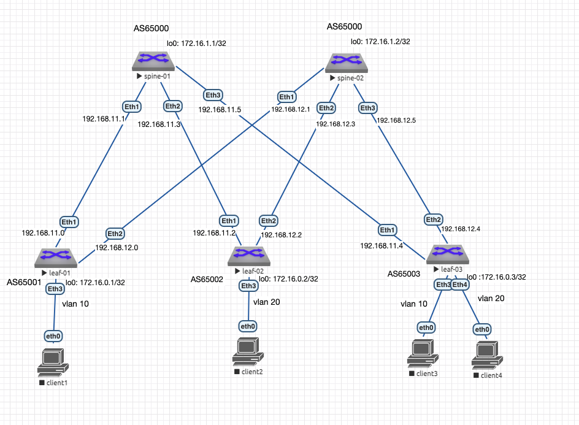

Настройка ip адресов и проверка связности на point to point link'ах выполнена в [Лабораторной работе № 1](https://github.com/IamMemasik/OTUS-Network-design/tree/main/lab-01)

В качетсве underlay сети используется eBGP, разбор и настройка выполнена в [Лабораторной работе № 4](https://github.com/IamMemasik/OTUS-Network-design/blob/main/lab-04/Readme.md)

Настройка L2 сервиса выполнена в [Лабораторной работе № 5](https://github.com/IamMemasik/OTUS-Network-design/blob/main/lab-05/readme.md)

## Настройка Asymmetric IRB


### Настройка на всех leaf 

```
vrf instance INSIDE
ip routing vrf INSIDE
interface Vlan10
   vrf INSIDE
   ip address virtual 10.1.10.1/24
!
interface Vlan20
   vrf INSIDE
   ip address virtual 10.1.20.1/24

ip virtual-router mac-address 00:00:00:00:00:01
```
*Для asymmetric IRB необходимо чтобы на каждом leaf были vlan которые учавствуют в сетевом обмене, поэтому убедимся что на всех leaf есть vlan 10 и 20.*

### Проверка

Запустим пинг из 10 vlan в 20 vlan 

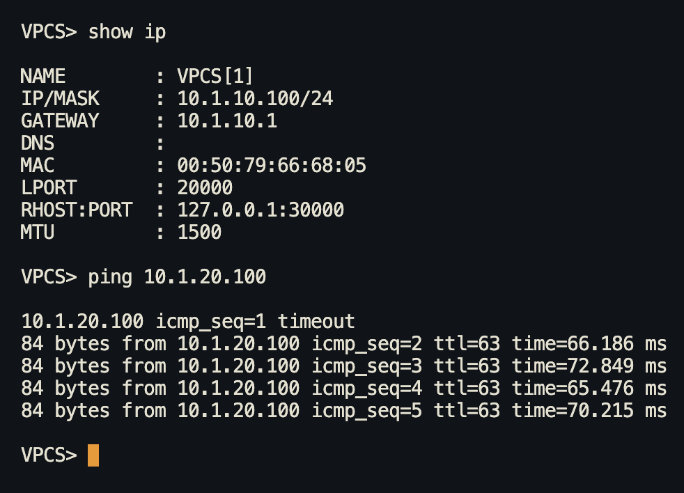

Обратим внимание на TTL, запустив wireshark вне фабрики на интерфейсе смотрящего в сторону клиента.


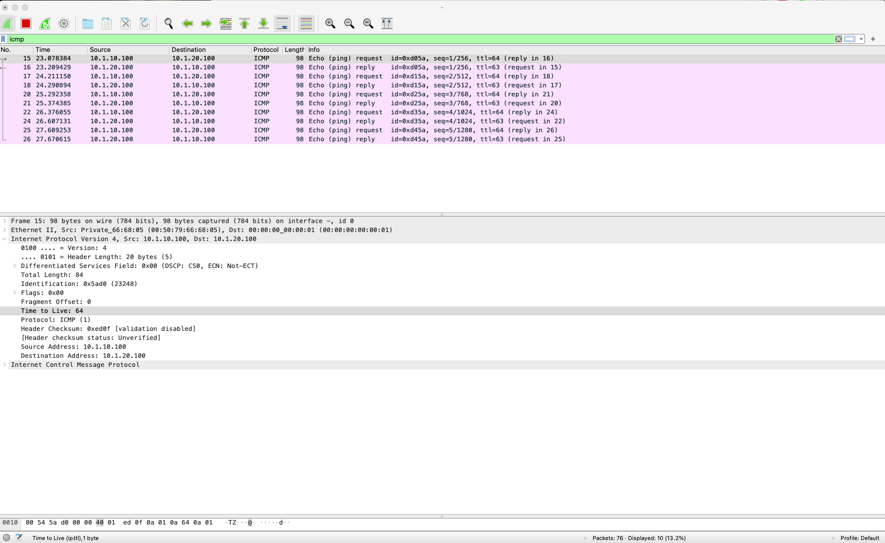

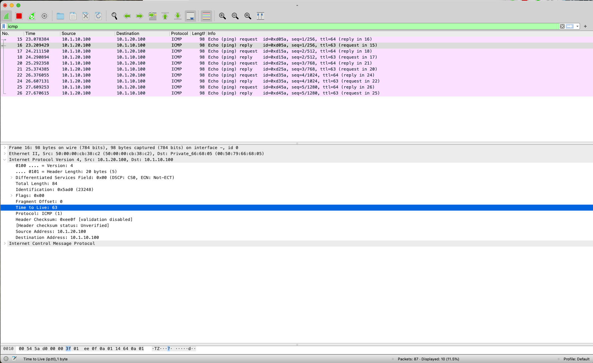

Заметим, что TTL запороса пакета 64, а ответ 63, что говорит о том, что пакет был смаршрутизирован один раз.

Маршрутизация произошла один раз, на ближейшем leaf, а дальше происходит коммутация, обратно по такому же принципу.

Попингуем всех клиентов и просмотрим type 2 маршруты.

**leaf-01**

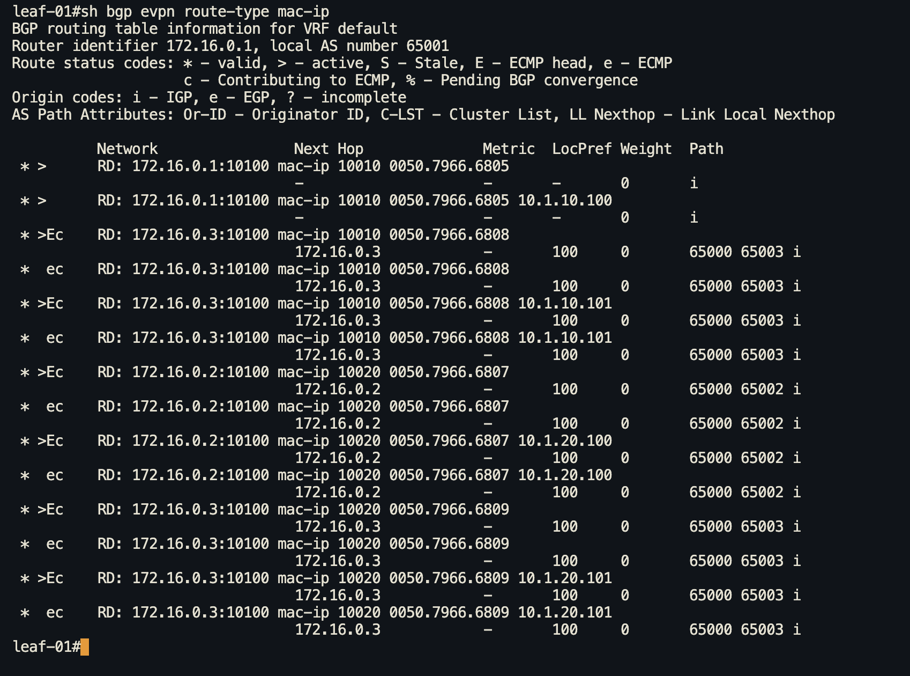

Заметим, что добавилcя ip адрес.

## Настройка Symmetric IRB

### Настройка на leaf

**leaf-01**

```
interface Vxlan1
   vxlan vrf INSIDE vni 50000
router bgp 65001
   vrf INSIDE
      rd 172.16.0.1:50000
      route-target import evpn 100:50000
      route-target export evpn 100:50000
```

**leaf-02**
```
interface Vxlan1
   vxlan vrf INSIDE vni 50000
router bgp 65002
   vrf INSIDE
      rd 172.16.0.2:50000
      route-target import evpn 100:50000
      route-target export evpn 100:50000
```

**leaf-03**
```
interface Vxlan1
   vxlan vrf INSIDE vni 50000
router bgp 65003
   vrf INSIDE
      rd 172.16.0.3:50000
      route-target import evpn 100:50000
      route-target export evpn 100:50000
```

### Проверка

Запустим пинг из 10 vlan в 20 vlan .

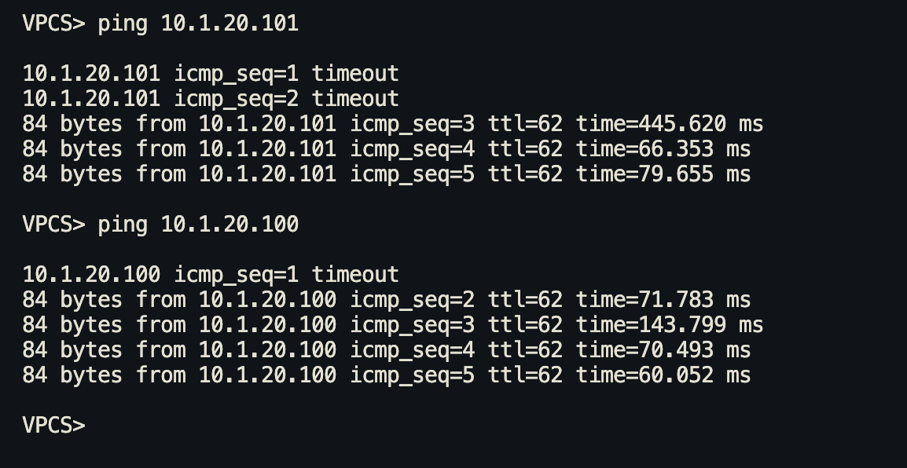

Заметим, что TTL снижается на 2.
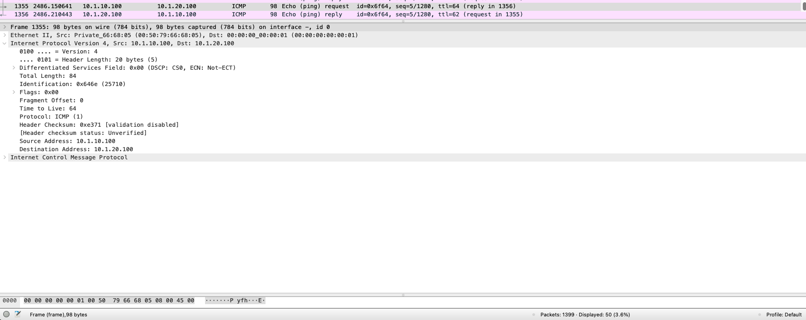

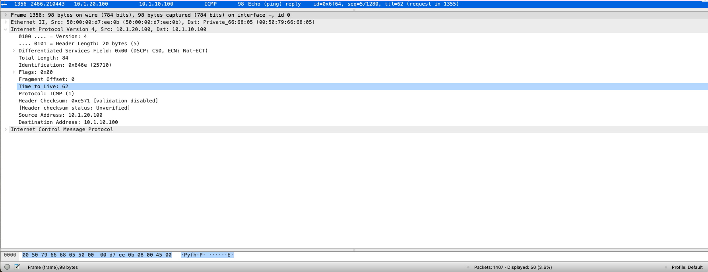

Был 64, стал 62, так как пакет теперь маршрутизируется в двух местах.

Просмотрим L3 VNI и дополнительное community EVPN Router MAC.

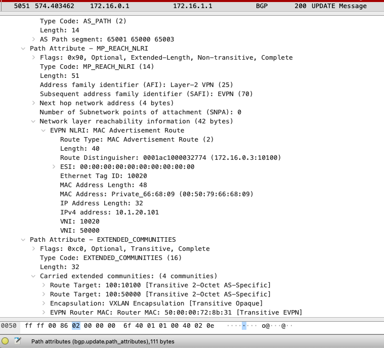


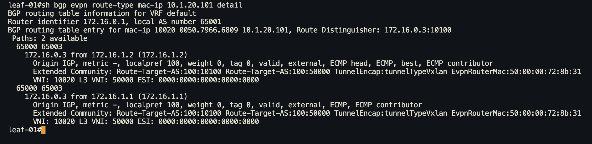

Просмотрим как учавствуют в Vxlan L3 vni и EVPN Router MAC.

icmp request 
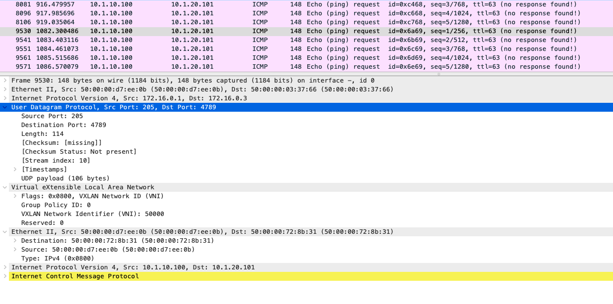

icmp reply
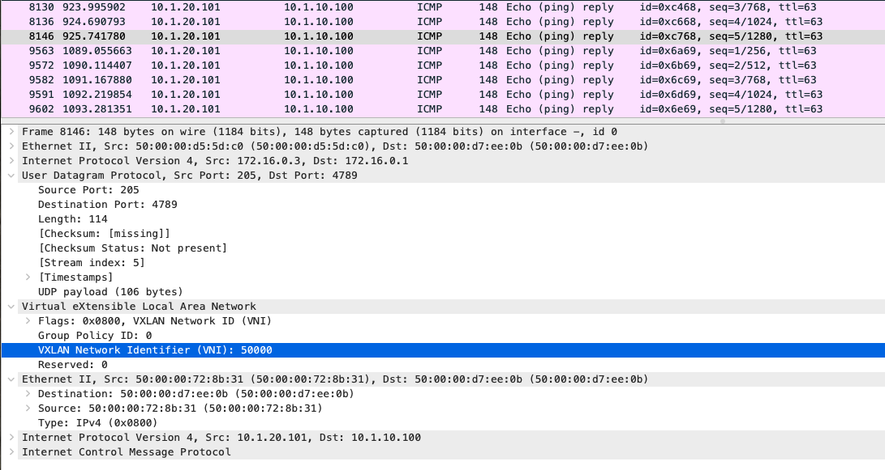


Просмотрим таблицу машрутов за vrf.

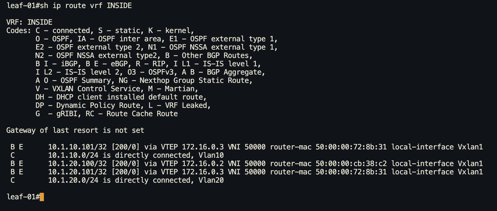


## Итоговая конфигурация в файлах:

### Asymmetric IRB
[Leaf-01](https://github.com/IamMemasik/OTUS-Network-design/tree/main/lab-06/Asymmetric-IRB/leaf-01.txt)

[Leaf-02](https://github.com/IamMemasik/OTUS-Network-design/tree/main/lab-06/Asymmetric-IRB/leaf-02.txt)

[Leaf-03](https://github.com/IamMemasik/OTUS-Network-design/tree/main/lab-06/Asymmetric-IRB/leaf-03.txt)


### Symmetric IRB
[Leaf-01](https://github.com/IamMemasik/OTUS-Network-design/tree/main/lab-06/Symmetric-IRB/leaf-01.txt)

[Leaf-02](https://github.com/IamMemasik/OTUS-Network-design/tree/main/lab-06/Symmetric-IRB/leaf-02.txt)

[Leaf-03](https://github.com/IamMemasik/OTUS-Network-design/tree/main/lab-06/Symmetric-IRB/leaf-03.txt)


