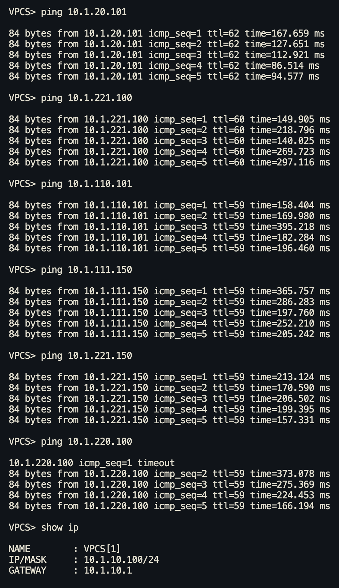

# VxLAN. Routing.

## Цель 
Реализовать передачу суммарных префиксов через EVPN route-type 5

## Топология 


Настройка ip адресов и проверка связности на point to point link'ах выполнена в [Лабораторной работе № 1](https://github.com/IamMemasik/OTUS-Network-design/tree/main/lab-01)

В качетсве underlay сети используется eBGP, разбор и настройка выполнена в [Лабораторной работе № 4](https://github.com/IamMemasik/OTUS-Network-design/blob/main/lab-04/Readme.md)

Настройка L2 сервиса выполнена в [Лабораторной работе № 5](https://github.com/IamMemasik/OTUS-Network-design/blob/main/lab-05/readme.md)


Настройка L3 сервиса с Symmetric irb выполнена в  [Лабораторной работе № 6](https://github.com/IamMemasik/OTUS-Network-design/blob/main/lab-06/readme.md)


## Создание дополнительных vrf
В прошлых лабораторных работах уже был настроен vrf INSIDE, в нем находится две сети:  

- Vlan 10 - 10.1.20.0/24 - vni 10010
- Vlan 20 - 10.1.20.0/24 - vni 10020

Создадим ещё два vrf, для реализации различных способв route leaking, рассмотренных далее.

Создадим VRF OTUS с сетями:
- Vlan 110 - 10.1.110.0/24 - vni 10110
- Vlan 111 - 10.1.111.0/24 - vni 10111

Создадим VRF DMZ с сетями:

- vlan 220 - 10.1.220.0/24 - vni - 10220
- vlan 221 - 10.1.221.0/24 - vni - 10221

### Создание vrf OTUS

**leaf**
```

vrf instance OTUS                    # Создание VRF
ip routing vrf OTUS                  # Включение маршрутизации
interface Vxlan1
vxlan vlan 110 vni 10110      
vxlan vlan 111 vni 10111     
vxlan vrf OTUS vni 60000            # Добавление в VXLAN с l3-vni 60000
 
vlan 110
vlan 111
interface Vlan110                    
   vrf OTUS  
   ip address virtual 10.1.110.1/24  # Создаём anycast gateway
interface Vlan111
   vrf OTUS
   ip address virtual 10.1.111.1/24

router bgp 65001
   vlan-aware-bundle INSIDE               # Добавляем VLAN в MAC VRF
    vlan add 110,111   
   vrf OTUS                               # Настраиваем export и import машрутов в evpn 
      rd 172.16.0.1:60000                 # На leaf будет различаться по loopback                     
      route-target import evpn 100:60000
      route-target export evpn 100:60000


interface eth5                            # Подключим клиентов в ранее созданный vlan для OTUS 
switchport mode access
switchport access vlan 110

interface Port-Channel1                   # Отдаём vlan в сторону esi 
   switchport trunk allowed vlan add 111,221
```

#### Проверка связности внутри vrf OTUS

С otus-01 до otus-03 и otus-02


### Создание vrf DMZ

**leaf** 
```
vrf instance DMZ                    
ip routing vrf DMZ                  
interface Vxlan1  
vxlan vlan 220 vni 10220      
vxlan vlan 221 vni 10221       
vxlan vrf DMZ vni 56000           
 
vlan 220
vlan 221
interface Vlan220                    
   vrf DMZ  
   ip address virtual 10.1.220.1/24  
interface Vlan221
   vrf DMZ
   ip address virtual 10.1.221.1/24

router bgp 65001
   vlan-aware-bundle INSIDE               
    vlan add 220,221   
   vrf DMZ                               
      rd 172.16.0.1:56000         
      route-target import evpn 100:56000
      route-target export evpn 100:56000

interface eth6
   switchport mode access
   switchport access vlan 220

interface Port-Channel1 
   switchport trunk allowed vlan add 111,221
```

Такжк добавим vlan на switch 

**switch**

```
vlan 111,221

interface eth3
switchport access vlan 111

interface eth4
switchport access vlan 221
```


#### Проверка связности внутри vrf DMZ
С dmz-01 до dmz-02, dmz-03, dmz-04.


#### Проверка отсутсвия связности между vrf


Просмотрим маршруты внутри каждого vrf

INSIDE


OTUS


DMZ


Попробуем из одного vrf допинговаться до другого
OTUS <--> DMZ


INSIDE <--> OTUS


INSIDE <--> dmz


Видим, что ничего не работает.

## Реализация vrf leaking
Реализуем два vrf leaking'а

1) INSIDE <--> DMZ И OTUS - Через fw
2) INSIDE <--> OTUS - через leaf


### Настройка vrf leaking через fw

Настроим связность leaf-03 и fw

**fw**
```
hostname fw
ip routing
interface Ethernet1
   no switchport
   description "r:leaf-03"
!
interface Ethernet1.1
   description "r:leaf-03 c:vrf-inside"
   encapsulation dot1q vlan 1
   ip address 192.168.255.1/31

interface Ethernet1.2
   description "r:leaf-03 c:vrf-OTUS"
   encapsulation dot1q vlan 2
   ip address 192.168.255.3/31
!
interface Ethernet1.3
   description "r:leaf-03 c:vrf-DMZ"
   encapsulation dot1q vlan 3
   ip address 192.168.255.5/31
!

interface Loopback0
   ip address 172.16.255.1/32

router bgp 65500                              # Преднастроим BGP соседство с leaf-03
   router-id 172.16.255.1
   neighbor 192.168.255.0 remote-as 65003
   neighbor 192.168.255.0 description "r:leaf-03 c:vrf-INSIDE"
   neighbor 192.168.255.2 remote-as 65003
   neighbor 192.168.255.0 description "r:leaf-03 c:vrf-OTUS"
   neighbor 192.168.255.4 remote-as 65003
   neighbor 192.168.255.0 description "r:leaf-03 c:vrf-DMZ"
```
По сути, fw вообще не в курсе какие в нашей сети сущетсвуют vrf, об этом знает только фабрика, задача fw просто передать маршруты между своими соседями.

Но есть нюанс. Leaf находиться в AS 65003, он отдаст машрут в fw AS65500, fw должен отдать машруты в leaf, но в аттрибуте AS_PATH в исходящем update от fw мы увидим такой путь: 65003 65500 65003 и базовая работа BGP Loop Prevention не позволит принять такой update.

Одним вариантом решения проблемы будет допустить повторение своей AS с помощью опции Allowas-in 1 на leaf-03, она разрешит приём update содержащем собственную AS один раз.


**leaf-03**
```
interface Ethernet6
   no switchport
   description "r:fw"
!
interface Ethernet6.1
   encapsulation dot1q vlan 1
   vrf INSIDE
   ip address 192.168.255.0/31
   description "r:fw c:vrf-INSIDE"
!
interface Ethernet6.2
   encapsulation dot1q vlan 2
   vrf OTUS
   ip address 192.168.255.2/31
   description "r:fw c:vrf-OTUS"
!
interface Ethernet6.3
   encapsulation dot1q vlan 3
   vrf DMZ
   ip address 192.168.255.4/31
   description "r:fw c:vrf-DMZ"
!

router bgp 65003
   vrf DMZ
      neighbor 192.168.255.5 remote-as 65500
      neighbor 192.168.255.5 description "r:fw c:vf-DMZ"
      neighbor 192.168.255.5 allowas-in 2
      aggregate-address 10.1.220.0/23 summary-only       # Анонсируем только суммарный маршрут, а не /32
   !
   vrf INSIDE
      neighbor 192.168.255.1 remote-as 65500
      neighbor 192.168.255.1 description "r:fw c:vrf-INSIDE"
      neighbor 192.168.255.1 allowas-in 2
      aggregate-address 10.1.10.0/24 summary-only
      aggregate-address 10.1.20.0/24 summary-only
   !
   vrf OTUS
      neighbor 192.168.255.3 remote-as 65500
      neighbor 192.168.255.3 description "r:fw c:vrf-OTUS"
      neighbor 192.168.255.3 allowas-in 2
      aggregate-address 10.1.110.0/23 summary-only
```

Но это ещё не всё, на leaf-01 и leaf-02 и spine'ах надо тоже включить allowas-in.

**leaf-01**
```
router bgp 65001
   neighbor SPINE_OVERLAY allowas-in 1
```

**leaf-02** 

```
router bgp 65002
   neighbor SPINE_OVERLAY allowas-in 1
```

**Оба spine**
```
router bgp 65000
    neighbor LEAF_OVERLAY allowas-in 1
```


#### Проверка vrf-leaking через fw

Попробуем попинговать client1, находящегося в inside все сети.



Просмотрим трассу 


Видим, что в трафик проходит через сети 192.168.255.x что находятся на p2p линках между leaf-03 и leaf-03, отсюда можно сделать вывод, что leaking работает.


Просмотрим маршрутную информацию на leaf-01


Видим суммарные маршруты из INSIDE и OTUS в VRF DMZ
```
 B E      10.1.10.0/24 [200/0] via VTEP 172.16.0.3 VNI 56000 router-mac 50:00:00:72:8b:31 local-interface Vxlan1
 B E      10.1.20.0/24 [200/0] via VTEP 172.16.0.3 VNI 56000 router-mac 50:00:00:72:8b:31 local-interface Vxlan1
 B E      10.1.110.0/23 [200/0] via VTEP 172.16.0.3 VNI 56000 router-mac 50:00:00:72:8b:31 local-interface Vxlan1
```


Видим суммарные маршруты из OTUS и DMZ в VRF INSIDE
```
 B E      10.1.110.0/23 [200/0] via VTEP 172.16.0.3 VNI 60000 router-mac 50:00:00:72:8b:31 local-interface Vxlan1
 B E      10.1.220.0/23 [200/0] via VTEP 172.16.0.3 VNI 60000 router-mac 50:00:00:72:8b:31 local-interface Vxlan1
```


Видим суммарные маршруты из INSIDE и DMZ в VRF OTUS
```
 B E      10.1.10.0/24 [200/0] via VTEP 172.16.0.3 VNI 60000 router-mac 50:00:00:72:8b:31 local-interface Vxlan1
 B E      10.1.20.0/24 [200/0] via VTEP 172.16.0.3 VNI 60000 router-mac 50:00:00:72:8b:31 local-interface Vxlan1
 B E      10.1.220.0/23 [200/0] via VTEP 172.16.0.3 VNI 60000 router-mac 50:00:00:72:8b:31 local-interface Vxlan1
```

Просмотрим type 5 маршруты в таблице bgp 


Подробнее посмотрим type 5 маршрут для префикса из vrf OTUS


Просмотрим таблицу ip bgp на leaf-03 


### Настройка vrf leaking через fw без allowas-in

Сделаем разные AS на spine

Обновлённая топология: 


**spine-01**

```
no router bgp 65000
router bgp 65101
   router-id 172.16.1.1
   maximum-paths 10
   neighbor LEAF_OVERLAY peer group
   neighbor LEAF_OVERLAY update-source Loopback0
   neighbor LEAF_OVERLAY ebgp-multihop 2
   neighbor LEAF_OVERLAY send-community
   neighbor 172.16.0.1 peer group LEAF_OVERLAY
   neighbor 172.16.0.1 remote-as 65001
   neighbor 172.16.0.2 peer group LEAF_OVERLAY
   neighbor 172.16.0.2 remote-as 65002
   neighbor 172.16.0.3 peer group LEAF_OVERLAY
   neighbor 172.16.0.3 remote-as 65003
   neighbor 192.168.11.0 remote-as 65001
   neighbor 192.168.11.2 remote-as 65002
   neighbor 192.168.11.4 remote-as 65003
   redistribute connected route-map UNDERLAY_EXPORT
   !
   address-family evpn
      neighbor LEAF_OVERLAY activate
   !
   address-family ipv4
      no neighbor LEAF_OVERLAY activate
```

**spine-02**

```
no router bgp 65000
router bgp 65102
   router-id 172.16.1.2
   maximum-paths 10
   neighbor LEAF_OVERLAY peer group
   neighbor LEAF_OVERLAY update-source Loopback0
   neighbor LEAF_OVERLAY ebgp-multihop 2
   neighbor LEAF_OVERLAY send-community
   neighbor 172.16.0.1 peer group LEAF_OVERLAY
   neighbor 172.16.0.1 remote-as 65001
   neighbor 172.16.0.2 peer group LEAF_OVERLAY
   neighbor 172.16.0.2 remote-as 65002
   neighbor 172.16.0.3 peer group LEAF_OVERLAY
   neighbor 172.16.0.3 remote-as 65003
   neighbor 192.168.12.0 remote-as 65001
   neighbor 192.168.12.2 remote-as 65002
   neighbor 192.168.12.4 remote-as 65003
   redistribute connected route-map UNDERLAY_EXPORT
   !
   address-family evpn
      neighbor LEAF_OVERLAY activate
   !
   address-family ipv4
      no neighbor LEAF_OVERLAY aendctivate
```

**leaf-01**
```
router bgp 65001
   no neighbor SPINE peer group
   no neighbor SPINE remote-as 65000
   no neighbor SPINE_OVERLAY allowas-in 1
   no neighbor SPINE_OVERLAY remote-as 65000
   neighbor 192.168.11.1 remote-as 65101
   neighbor 192.168.12.1 remote-as 65102
   neighbor 172.16.1.1 remote-as 65101
   neighbor 172.16.1.2 remote-as 65102   
```

**leaf-02**
```
router bgp 65002
   no neighbor SPINE peer group
   no neighbor SPINE remote-as 65000
   no neighbor SPINE_OVERLAY allowas-in 1
   no neighbor SPINE_OVERLAY remote-as 65000
   neighbor 192.168.11.3 remote-as 65101
   neighbor 192.168.12.3 remote-as 65102
   neighbor 172.16.1.1 remote-as 65101
   neighbor 172.16.1.2 remote-as 65102   
```

**leaf-03**
```
router bgp 65003
   no neighbor SPINE peer group
   no neighbor SPINE remote-as 65000
   no neighbor SPINE_OVERLAY allowas-in 1
   no neighbor SPINE_OVERLAY remote-as 65000
   neighbor 192.168.11.5 remote-as 65101
   neighbor 192.168.12.5 remote-as 65102
   neighbor 172.16.1.1 remote-as 65101
   neighbor 172.16.1.2 remote-as 65102   
```

на fw сделаем перезапись AS_PATH:
**fw**
```
router bgp 65500
   neighbor 192.168.255.0 remove-private-as all replace-as
   neighbor 192.168.255.2 remove-private-as all replace-as
   neighbor 192.168.255.4 remove-private-as all replace-as
```

#### Проверка vrf leaking через fw без allowas-in 

Просмотрим type 5 маршруты в bgp evpn таблице


Просмотрим маршруты в vrf inside


Просмотрим маршруты в vrf OTUS


Просмотрим маршруты в vrf DMZ


Проверим пинг и трассу


Такой вариант тоже работает, но при двух spine нужно учитывать, что если один нужно вывести на обслуживание, то необходимо сделать allowas-in, чтобы сохранить работу vrf-leaking

### Настройка leaking INSIDE <--> OTUS через leaf

С помощью route-target import можно принять маршруты из другого vrf на самом leaf.

Добавим в VRF INSIDE и OTUS на import те же значения, что на export друг у друга. 

**leaf-0X**
```
router bgp 6500X
   vrf INSIDE
      route-target import evpn 100:60000
   !
   vrf OTUS
      route-target import evpn 100:50000
```

Проверим leaking:


Видим, что до сети в vrf OTUS всё происходит в рамках лифа, а для DMZ идёт через fw.

Но я это уберу.

## Отдача внешнего машрута в фабрику
На fw отдадим внешний машрут 8.8.8.0/24

**fw**
```
interface Vlan888
   ip address 8.8.8.1/24

interface Ethernet2
   switchport access vlan 888

router bgp 65500
   network 8.8.8.0/24
```


### Проверим получение внешнего машрута
```

```
Заметим маршрут во всех vrf.

Проверим пинг


## Итоговая конфигурация в файлах:


*Было решено убрать bfd так как оно очень мешало в eve-ng, часто падало соседство*

### Конфигуация с одинаковыми AS на spine c allowas-in:
[Leaf-01](https://github.com/IamMemasik/OTUS-Network-design/tree/main/lab-08/Allowas-in/Leaf-01.txt)

[Leaf-02](https://github.com/IamMemasik/OTUS-Network-design/tree/main/lab-08/Allowas-in/Leaf-02.txt)

[Leaf-03](https://github.com/IamMemasik/OTUS-Network-design/tree/main/lab-08/Allowas-in/Leaf-03.txt)

[Spine-01](https://github.com/IamMemasik/OTUS-Network-design/tree/main/lab-08/Allowas-in/Spine-01.txt)

[Spine-02](https://github.com/IamMemasik/OTUS-Network-design/tree/main/lab-08/Allowas-in/Spine-02.txt)

[fw](https://github.com/IamMemasik/OTUS-Network-design/tree/main/lab-08/Allowas-in/fw.txt)


### Конфигурация с разными AS на spine без allowas-in с перезаписью AS_PATH на fw


[Leaf-01](https://github.com/IamMemasik/OTUS-Network-design/tree/main/lab-08/AS-pathoverride/Leaf-01.txt)

[Leaf-02](https://github.com/IamMemasik/OTUS-Network-design/tree/main/lab-08/AS-pathoverride/Leaf-02.txt)

[Leaf-03](https://github.com/IamMemasik/OTUS-Network-design/tree/main/lab-08/AS-pathoverride/Leaf-03.txt)

[Spine-01](https://github.com/IamMemasik/OTUS-Network-design/tree/main/lab-08/AS-pathoverride/Spine-01.txt)

[Spine-02](https://github.com/IamMemasik/OTUS-Network-design/tree/main/lab-08/AS-pathoverride/Spine-02.txt)

[fw](https://github.com/IamMemasik/OTUS-Network-design/tree/main/lab-08/AS-pathoverride/fw.txt)
